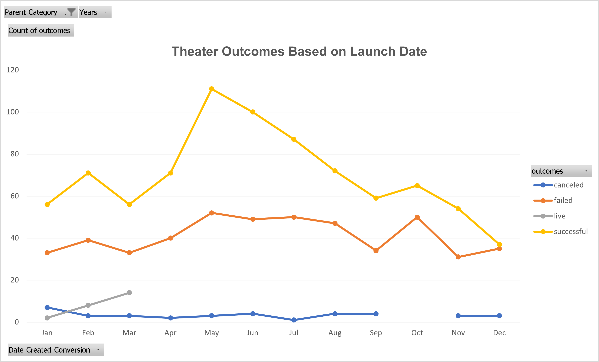
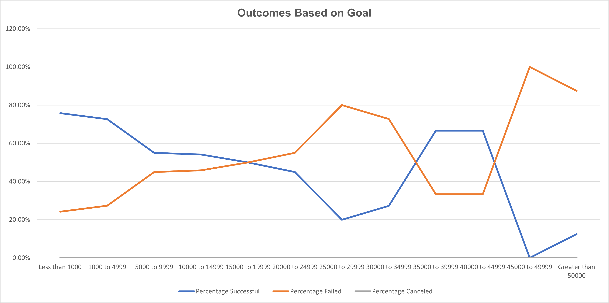

# Kickstarting with Excel By Varun Rao

## Excel Sheet: [Kickstarter_Challenge](Kickstarter_Challenge.xlxs).

## Overview of Project
After Louise's play fever we want to find out how different campaigns performed in relation to launch dates and funding goals. 
The first analysis done was understanding trends on how the outcomes of Theater kickstarters were affected by date.
The second analysis done was understanding trends on how the fundraiser goal affected a kickstarters outcome.   
### Purpose
The purpose of doing this analysis is to further understand how trends and numbers can tell a story and to further understanding how to effectivley manipulate data with excels powerful tools
## Analysis and Challenges

### Analysis of Outcomes Based on Launch Date

The analysis of outcomes based on launch date revealed a few trends such as May having the highest number of successfull theatre kickstarters which progressively decreases to september.
December has the lowest number of successfull outcomes. May also has the highest failed theatre kickstarters which implys that the highest demand for theatre kickstarters is at this time but supply is also very high causing many to fail aswell.
The number of cancelled theatre kickstarters remained mostly constant implying that date does not have an impact on kickstarters being cancelled.
### Analysis of Outcomes Based on Goals

For the analysis of outcomes based on goals there are a few trends. The highest percentage of successfull kickstarters at approximately 76% were kickstarters with a goal of less than 1000 implying that a lower goal means the chance of a kickstarter reaching that goal is much lower.
The highest percentage of failed kickstarters at a 100% failure rate were kickstarters with a goal between 45000 to 49999. What is interesting is that kickstarters with a goal above 50000 have a sucess rate of 12.5% even which might mean that these projects have much more hype and support behind them if they actually succeed
The goal ranges that are still high but have the highest rate of success would be from the ranges of 35000 to 39999 and 40000 to 44999 with a sucess rate of aproximatley 67% implying that high budget kickstarters that still have a higher success rate belong in this goal range.
### Challenges and Difficulties Encountered
For the challenges there was some data that did not make much sense but I did not see any instruction to remove which was the live outcome. As being live is not relevant when looking at the data from a future standpoint.
## Results

- What are two conclusions you can draw about the Outcomes based on Launch Date?
1. May has the highest number of succesfull theatre kickstarters aswell as the most failed 
2. December has the least number of succesfull theatre kickstarters 
- What can you conclude about the Outcomes based on Goals?
1. The highest percantage of kickstarers that succeeded were less than 1000 with a success rate of approximatley 76%.
2. The most failed kickstarters with a failed rate of 100% were in between 45000 to 49999
3. kickstarters with a high goal range but still had close to the highest success rates were the 35000 to 39999 and 40000 to 44999 goal ranges with a success rate of aproximatley 67%
- What are some limitations of this dataset?
1. The dataset only provides the final snapshot of the fundraising effort but does not show the fundraising process before the outcome
the dataset does not provide enough data about the reason of failure or success to be able to do more analysis as to how we can change the outcome
- What are some other possible tables and/or graphs that we could create?
1. Bar and Pie graphs can be created to show for example the successful and failed outcomes.
